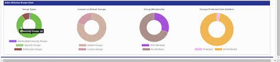

# Spotifly

Hey, all you cool listeners. This is Spotifly Radio: the place where your quest for music and data collide. 

We pulled all sorts of [**data**](https://www.kaggle.com/yamaerenay/spotify-dataset-19212020-160k-tracks) for you to feast your eyes and ears on. So, kick back and take it all in as our website lets you filter in all your music data needs like a cool breeze. 

## What We Have:
*  	160,000+ songs with 19 data points each
*  	4 separate visualizations showcasing different aspects of the data

## What We're Here For:
We know how much music moves each and every one of you. Spotify is one of the top music platforms in the U.S. And, Spotify is one top ways to reach that place music takes you. 
 
INSPIRATION: A dashboard page with multiple charts that update from the same data.
 
●  	Plotly dashboard with multiple filter options.
●  	One plot with an interactive axis to change between some of the song characteristics.

Finally, everything the casual viewer needs to know is contained in this [**slideshow**](https://docs.google.com/presentation/d/1SKnTBXshjlBazAfW8mUmEamAfDC1FD-3My9cVagANB0/edit?usp=sharing). 
 

